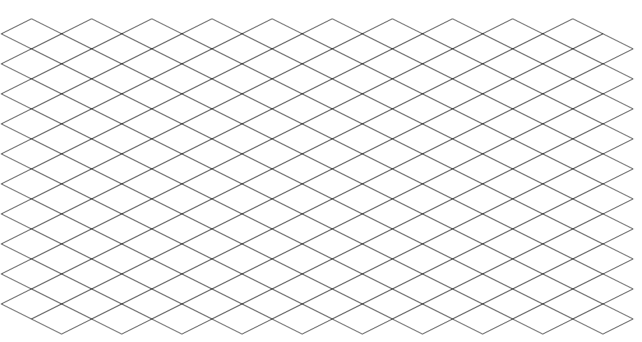

<p align="center">
  
</p>


# Hi there

  Snap is a framework on top of SFML.NET proving a lot of utility and an architectural proposal to make a 2D game.
  Written in C# .NET Core 3.1, this library is multiplateform. 

  

1. [Renderer](#Renderer)
2. [Grids](#Grids)
3. [Textures](#Textures)  
4. [Map](#Map)  
5. [Animations](#Animations)
6. [Fonts](#Fonts)
7. [Lightning](#Lightnings)
8. [Physics](#Physics)
9. [Collisions](#Collisions)
10. [Network](#Network)
11. [Sounds](#Sounds)
12. [Serialization](#Serialization)
13. [Utils](#Utils)

# Renderer

* The Snap.Graphical.Renderer class encapsulates the render window and how it works. It is an abstract class. Here an example :

```csharp
 public class MyRenderer : Renderer
    {
        public MyRenderer(VideoMode mode, string title, ContextSettings settings, Styles styles = Styles.Default) : base(mode, title, settings, styles)
        {
            // Create your ressources here
        }

        protected override void Draw()
        {
            // Draw your ressources here
        }
    }
```

# Grids

* For each grid, there are events dealing with user inputs 
```csharp
public delegate void MouseEvent(T cell);
public event MouseEvent OnMouseEnter;
public event MouseEvent OnMouseLeave;
public event MouseEvent OnMouseRightClick;
public event MouseEvent OnMouseLeftClick;
```

* There is two rendering mode, optimized and unoptimized mode. 
  this parameter can be passed in the Grid constructor, its default value is false.
  In the optimized mode, the events will not be processed, and the rendering will be done using a vertex buffer. 
  The appearance of the cells will not be editable. Otherwise, each cell will be represented by ```SFML.Graphics.ConvexShape```. 


## Orthogonal Grid

* Namespace : ```Snap.Graphics.Grids.GridOrthogonal```

* Represents a two-dimensional orthogonal grid. Used to map tiles in a side scroller or top down game. 


## Isometric Grid

* Namespace : ```Snap.Graphics.Grids.GridIsometric```

* Represents an isometric grid. Also rendered using VertexBuffer.



# Utils

## Camera2D

* Camera2D is what you need if you want to scroll, rotate or zoom your world. They are also the key to creating split screens and mini-maps.
  you can use ``` Move(Vector2f delta) ``` to move the camera. 

  > WIP

## KeyboardCamera

  > WIP